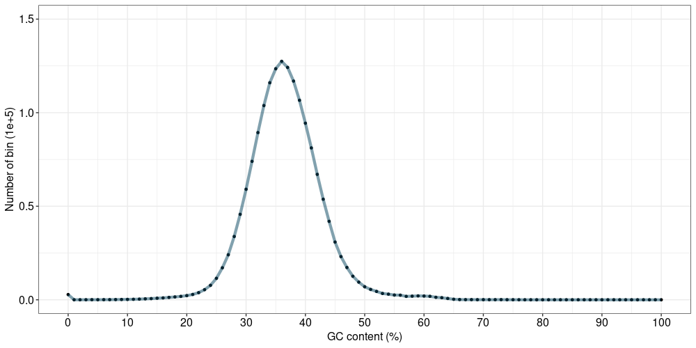
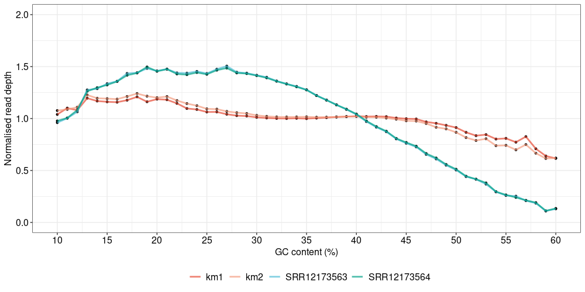

**The pipeline for how to calculate the GC bias of sequencing reads.**

Firstly, we need to select the bin size, the length of bin, to calculate the GC content. Here, we chose the 1 Kbp for zebrafish with approximately 1.6 Gbp genome size.

The following commands can help you split the genome into 1k bin and put the position to a bed file.

```shell
samtools faidx GRCz11.fa 
bedtools makewindows -g GRCz11.fa.fai -w 1000 > zf_1k.bed
```

the demo for bed file:

```shell
#chr	start	end
NC_007112.7	0	1000
NC_007112.7	1000	2000
NC_007112.7	2000	3000
```

Then to get the GC content for each bin, this can help you.

```shell
bedtools nuc -fi GRCz11.fa -bed zf_1k.bed > zf_1k.tmp.txt
```

the demo for result:

```shell
#1_usercol	2_usercol	3_usercol	4_pct_at	5_pct_gc	6_num_A	7_num_C	8_num_G	9_num_T	10_num_N	11_num_oth	12_seq_len
NC_007112.7	0	1000	0.594000	0.406000	303	207	199	291	0	0	1000
NC_007112.7	1000	2000	0.597000	0.403000	308	182	221	289	0	0	1000
NC_007112.7	2000	3000	0.610000	0.390000	309	186	204	301	0	0	1000
```

here, we only need the GC content.

```shell
grep -v "#" zf_1k.tmp.txt | awk '{print $1 "\t" $2 "\t" $3 "\t" $5}' > zf_1k.GC.info
```

the demo for this:

```shell
#chr	start	end	GC
NC_007112.7	0	1000	0.406000
NC_007112.7	1000	2000	0.403000
NC_007112.7	2000	3000	0.390000
NC_007112.7	3000	4000	0.368000
```

After get the GC content for each bin, we need to think how to get the read coverage of datasets for these bins. All the datasets need to be aligned with the reference and get the bam files.

```shell
#for Nanopore long reads
minimap2 -ax map-ont -t {threads} {ref.mmi} {sample1.fastq} > sample1.sam 
#for NGS short reads
bwa mem -t {threads} {ref} {sample_R1.fastq} {sample_R2.fastq} > sample1.sam 

samtools view -F4 -bS -@ {threads} sample1.sam | samtools sort -@ {threads} -o sample1.bam
samtools index -@ {threads} sample1.bam
```

Then we can count the read coverage from the bam files.

```shell
samtools bedcov zf_1k.bed sample1.bam | awk '{print $1 "\t" $2 "\t" $3 "\t" $4/1000}'
```

the demo for results:

```shell
#chr	start	end	readCoverage
NC_007112.7	0	1000	9.561
NC_007112.7	1000	2000	15.043
NC_007112.7	2000	3000	11.233
NC_007112.7	3000	4000	14.425
NC_007112.7	4000	5000	12.654
NC_007112.7	5000	6000	5.145
```

Then we need to merge the files of read coverage and GC content based on the position.

```shell
GC	SRR12173563	SRR12173564	km1	km2
40.6	9.561	15.322	4.886	7
40.3	15.043	20.091	5.622	7
39	11.233	18.699	5.763	8.551
36.8	14.425	22.258	4.601	9
35.2	12.654	19.608	5.679	9.751
```

The following python script can help to calculate the read coverage and counted number at different GC content.

```python
# the GC content belong to [12.5, 13.5) was regard as 13.
import pandas as pd
Mydate = pd.read_csv("test.bed", delim_whitespace=True) # header=T
for i in range(0,101):
    tmp = Mydate[(i-0.5 <= Mydate["GC"]) & (Mydate["GC"] < i+0.5)].copy()
    ave_dp_1 = tmp["SRR12173563"].mean()
    ave_dp_2 = tmp["SRR12173564"].mean()
    ave_dp_3 = tmp["km1"].mean()
    ave_dp_4 = tmp["km2"].mean()
    print(str(i) + "\tkm1\t" + str(ave_dp_3))
    print(str(i) + "\tkm2\t" + str(ave_dp_4))
    print(str(i) + "\tSRR12173563\t" + str(ave_dp_1))
    print(str(i) + "\tSRR12173564\t" + str(ave_dp_2))
    print(str(i) + "\tcount\t" + str(len(tmp)))
```

The demo for result:

```shell
#GC	type	value
0	km1	0.008293949158610812
0	km2	0.009032223415682062
0	SRR12173563	0.001368779090583602
0	SRR12173564	0.0026186895810955957
0	count	2793
1	km1	2.1374545454545455
1	km2	3.0680909090909094
1	SRR12173563	0.45972727272727276
1	SRR12173564	0.6091818181818182
```

Then we can plot the distribution of counted number for each GC content with R.

```R
df <- read.csv("out.bed", sep = "\t", header = T)
GC_distribution <- df[which(df$type=="count"),]

ggplot(GC_distribution,aes(x=GC, y=number/1e+5)) + 
	geom_point(size=1) +
	geom_line(color="#05445E", alpha=0.5, size=1.5) +  theme_bw() +
	scale_x_continuous(name="GC content (%)", limits=c(0,100),breaks=seq(0,100,10)) +
	scale_y_continuous(name="Number of bin (1e+5)", limits=c(0,1.5),breaks=seq(0,1.5,0.5)) +
	theme(legend.title = element_blank(),
          axis.text=element_text(size=12, colour = "black"),
          axis.title=element_text(size=12, colour = "black"))
```

The demo of figure



Then we can found that most of bins were distributed from 10% to 60% GC content. so we only calculated the relationship between GC content and read coverage among these.  We normalized the read coverage by dividing the coverage of each GC content level within this range by the overall average read coverage.

```shell
#get the overall average read coverage at GC content from 10 to 60%
grep SRR12173563 out.bed  | awk '{if($1>=10)print $0}' | awk '{if($1<=60) print $0}' | awk '{sum += $3}END{print sum/NR}'#6.13522
grep SRR12173564 out.bed  | awk '{if($1>=10)print $0}' | awk '{if($1<=60) print $0}' | awk '{sum += $3}END{print sum/NR}'#9.15549
grep km1 out.bed  | awk '{if($1>=10)print $0}' | awk '{if($1<=60) print $0}' | awk '{sum += $3}END{print sum/NR}' #7.76684
grep km2 out.bed  | awk '{if($1>=10)print $0}' | awk '{if($1<=60) print $0}' | awk '{sum += $3}END{print sum/NR}' #7.65381

#get the normalized read coverage
grep SRR12173563 out.bed  | awk '{if($1>=10)print $0}' | awk '{if($1<=60) print $0}' | awk '{print$1"\t"$2"\t"$3/6.13522}' >> nor.bed
grep SRR12173564 out.bed  | awk '{if($1>=10)print $0}' | awk '{if($1<=60) print $0}' | awk '{print$1"\t"$2"\t"$3/9.15549}' >> nor.bed
grep km1 out.bed  | awk '{if($1>=10)print $0}' | awk '{if($1<=60) print $0}' | awk '{print$1"\t"$2"\t"$3/7.76684}' >> nor.bed
grep km2 out.bed  | awk '{if($1>=10)print $0}' | awk '{if($1<=60) print $0}' | awk '{print$1"\t"$2"\t"$3/7.65381}' >> nor.bed
```

The R code for plotting.

```R
ggplot(df, aes(x=GC, y=value, color=type)) + theme_bw() +
	geom_point(size=1, color="black") + 
	geom_line(alpha=0.7, size=1) +
	scale_x_continuous(name="GC content (%)", limits=c(10,60),breaks=seq(10,60,5)) +
	scale_y_continuous(name="Normalised read depth", limits=c(0,2),breaks=seq(0,2,0.5)) +
	scale_color_manual(values = colorset) +
	theme(legend.title = element_blank(),
          axis.text=element_text(size=12, colour = "black"),
          axis.title=element_text(size=12, colour = "black"),
          legend.text = element_text(size=12,colour = "black"),
          legend.position = "bottom")
```

The demo of figure


